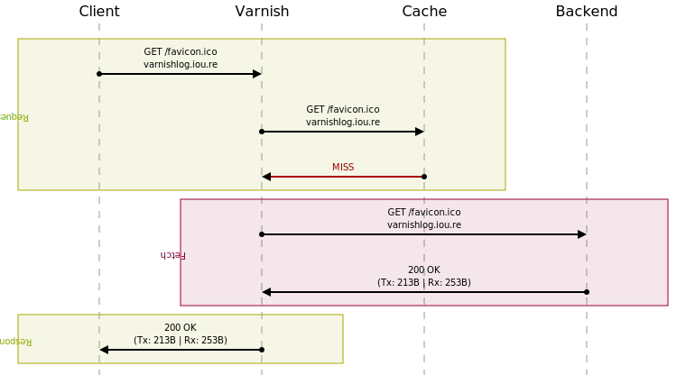

# svg-sequence

Small go library and CLI tool to generate sequence diagrams in SVG format.



## Usage

### As a library

```go
package main

import (
	"fmt"

	svgsequence "github.com/aorith/svg-sequence"
)

func main() {
	s := svgsequence.NewSequence()

	s.AddStep(svgsequence.Step{SourceActor: "Bob", TargetActor: "Maria", Description: "Hi! How are you doing?"})
	s.OpenSection("response", "")
	s.AddStep(svgsequence.Step{
		SourceActor: "Maria", TargetActor: "Maria",
		Description: "*Thinks*\nLong time no see...",
		Color:       "#667777",
	})
	s.AddStep(svgsequence.Step{SourceActor: "Maria", TargetActor: "Bob", Description: "Fine!"})
	s.CloseSection()
	svg, err := s.Generate()
	if err != nil {
		panic(err)
	}
	fmt.Println(svg)
}
```

This will print a basic SVG that you can save and open in the browser.

### Using the CLI

Check the command at [cmd/svgsequence](cmd/svgsequence).

See [cmd/svgsequence/examples](cmd/svgsequence/examples) for config examples.

```sh
# Install the CLI tool or run it from cmd/svgsequence
go install github.com/aorith/svg-sequence/cmd/svgsequence@latest

# Generate a sequence from a config file
$ svgsequence -i complete.cfg -o /tmp/sequence.svg
```
